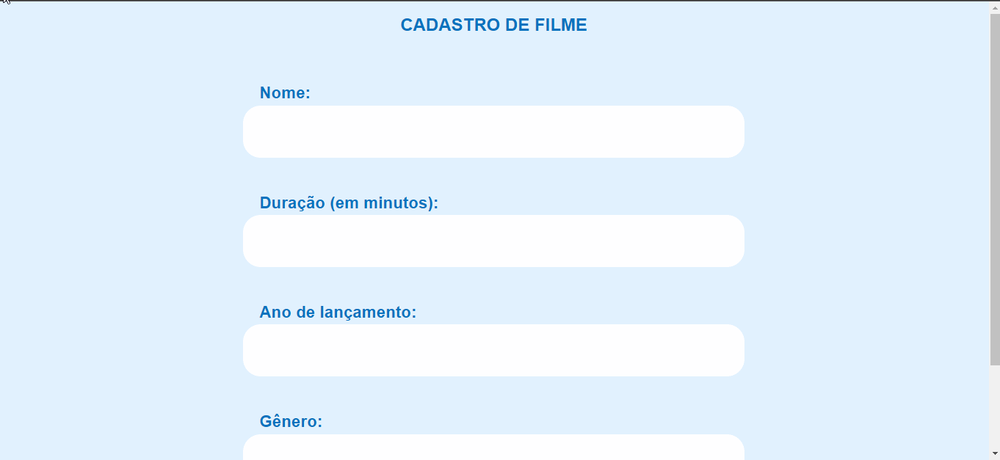
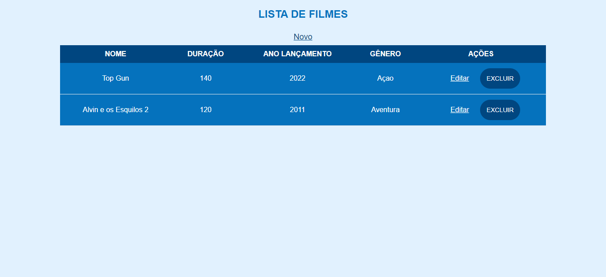

# SCREEN MATCH

O ScreenMatch é uma aplicação desenvolvida em Java Web + Spring, onde um usuário pode cadastrar, editar ou excluir os filmes 
que deseja. 

## Detalhes Técnicos 

[X] Desenvolvimento do CRUD 
[X] Desenvolvimento das Páginas HTML

# Cadastro + Listagem de Filmes 

# Edição + Exclusão de Filmes 

